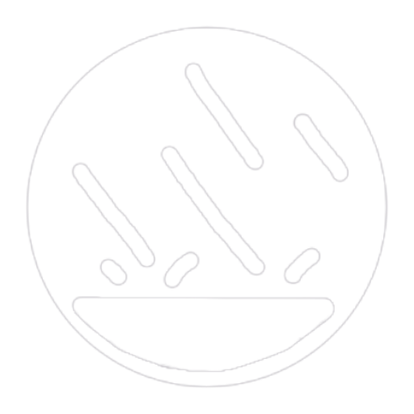

<div align="center">
  
<h1>🌧️ RainyDesk 💻</h1>
 <sup>v0.9.3-alpha</sup>
</div>


Ever wish it could rain on your desktop? Now it can, and you can use windows as umbrellas. ☔

**RainyDesk** is a peaceful desktop rain simulator that overlays semi-realistic pixelated rain on all your monitors. It's transparent, click-through, and never gets in your way — just some nice moist ambiance while you work, game, write, vibe, or relax.

### What does it do? ⛈
It makes it rain on your screen! That's pretty much it! Physics-based raindrops fall across all your monitors, splash when they hit stuff, and sound like actual rain. You can adjust how heavy the rain is, how whooshy the wind is, how everything sounds, and way, waaaay more.

**Perfect for...**

- *Working & vibing in a cozy atmosphere*
- *Focus assistance when studying or reading*
- *Relaxing without leaving your desk*
- *Pretending it's a rainy day when it's not and you're annoyed about it*

### Why does this exist?
Sometimes you just want it to rain. I know I sure do. This ~~scratches~~ splashes that itch.

### How do I use this? 🌂
Download the installer from [Releases](https://github.com/XYAgainAgain/RainyDesk/releases), double-click to install, and run it like any other app. No admin required! Windows might show a SmartScreen warning because the app isn't code-signed yet (costs mad ca$h) — just click **"More info"** then **"Run anyway."**

Once running, RainyDesk sits in your system tray. Left-click the tray icon to open the Rainscaper panel or right-click to open a small context menu:
- Pause/Resume
- Open Rainscaper
- Reset Panel (in case it gets stuck)
- Volume Presets (there's a bunch)
- Quit RainyDesk

The Rainscaper panel is a little more complicated, but you'll figure it out quickly, I hope. Later on, I'll be adding a Rainscaper Studio for the real rain-heads.

I've included a straightforward guide in the app itself; just click the version number in the bottom right of the panel, then click the **Help Me!** button. That same menu has a **Start with Windows** toggle so RainyDesk can launch on login, and a link to RainyDesk's GitHub repository.

#### Installation
Grab the latest `.exe` installer from [Releases](https://github.com/XYAgainAgain/RainyDesk/releases) (check the Assets section at the bottom) and follow the prompts. It installs to your user profile (no admin elevation needed) and adds a Start Menu shortcut.

Want to build from source instead? You'll need [Node.js](https://nodejs.org/) (v18+), [Rust](https://rustup.rs/) (1.77+), and the [Tauri v2 prerequisites](https://v2.tauri.app/start/prerequisites/). Then clone the repo and run these bad boys:

```bash
npm install
npm run dev
```

#### Requirements
- Windows 10/11 (Linux support coming eventually, X11 window manager only)
- An audio device such as headphones, earbuds, or speakers (preferably with surround sound)
- ~50 MB of free storage space
- At least one monitor lmao

### How does this work? ☔
Imagine your entire desktop — *all* your monitors, no matter how weirdly they're laid out — as one big invisible grid, like graph paper. RainyDesk draws a single giant transparent window over everything and makes it rain on that grid. There's also another one behind everything for extra rain (optional but recommended).

**The Magic:**
- **Void Mask:** RainyDesk figures out where your monitors *aren't* and ignores that space. Got gaps between your screens? Those are "walls" that rain can't pass through. If they're right next to each other, though, the water treats it all as one big space to splash around in! 🌊
- **Spawn Map:** Rain only falls from the top of each monitor, not from empty space. Or the other direction, if you click the Reverse Gravity toggle. 🙃
- **Puddles:** When rain hits something, it turns into water that spreads out like a real puddle. Well, a real 2D puddle. It's pretty close, at least!
- **Waterfalls:** Try lining up a bunch of windows and making a little cascade! Also, if your monitors are at different heights, puddles can spill over the edge and cascade down to the lower monitor.

**The Feel:**
- Drag a window over a puddle? *Sploosh!* Some water vanishes, some goes flying out sideways!
- Close/move a window with water on it? *Splash!* The puddle falls and splashes on whatever's below!
- Go fullscreen for a game or video? *Ssshh!* Rain hides on that screen but keeps falling on your others for maximum coze!

> *Is coze a word? Cozy but a noun? Whatever, you get it.* 

**The Point:**
It's like having a tiny rainstorm on your desktop, except you can't get wet. Not from RainyDesk, at least. Don't come running to me if you spill something on yourself.

## Current Status: Lightly Drizzling 🌦
RainyDesk is in active development and I'm really not rushing it because it's my first big non-website project. The core experience is working pretty well — rain physics simulation, mathematically correct audio synthesis, and a painfully detailed control panel (defaults to easy mode, don't worry).

**What Works:**

- **Cozy pixelated rain** falls on all your monitors (including vertical/rotated ones)
- **Cool water physics** with surface tension, cohesion/adhesion, dripping, pooling, and all that juicy fluid stuff with oodles of splishysplashies everywhere
- **Click-through** transparency so the rain never blocks your very important work
- **Custom logo/icon!** *Huge* thank you to my friend EHM for making it! 💙👩‍🎨🧡
- **System tray controls** for volume & other stuff
- **High refresh rate** support (anywhere from 15–360 Hz) via interpolation
- **Window detection**; rain flows around your windows unless maximized, and if it's maximized, it's muffled!
- **Rainscaper control panel** to tweak everything from rain intensity to gravity to gaiety
- **Procedural audio synthesis** for impact sounds, wind, background noise, and lots more!
- **Background rain sheets** made of atmospheric layers behind your windows with no physics; really sells the effect!
- **Render scale options** for chunky, normal, or fairly smooth visuals, your choice! Lower render scale is lighter on the graphics card, but it all sounds the same!
- **Gentle fade-in on startup** so no jump-scares from fake water lol
- **Matrix Mode** complete with a sweet synth tune that the rain plays automagically 😎
- **Oscillator knobs** that auto-drift sliders for natural variation in intensity, wind, turbulence, and splash size
- **FPS limiter** from 15 Hz all the way to 360 Hz (or uncapped) so you can balance performance vs. smoothness
- **Start with Windows** toggle so RainyDesk launches on login
- **Built-in help guide** accessible from the version menu in the panel
- **12 panel themes** including one that auto-matches your Windows accent color

**What's Coming:**

- ***Thunder synth!*** Because we *gotta* have the booms! ⛈
- **7 audio materials** which will be Glass, Metal, Wood, Concrete, Fabric, Foliage, & Water (each sounding different!)
- **Rainscape preset system** to save and load your perfect rainy day vibes as `.rain` files like `TinRoof.rain` & `Forest.rain`
- 3D spatial audio with full 5.1/7.1 surround sound support (like Dolby Atmos for Headphones)
- More visual effects (adjustable trails, droplet styles)
- Linux support (I pinkie promise!) and maybe MacOS later if my Mac Mini behaves
- Snow? 🌨👀

## Tech Specs for Big Nerds
RainyDesk is built with **Tauri** (Rust backend + WebView2), **Pixi.js** v8 rendering, & **Tone.js** audio synthesis... and a whole lot of gaffer's tape.

**Architecture:**

- One mega-overlay window spans your entire virtual desktop (all monitors, even weird setups)
- Another mega-background window renders atmospheric rain behind everything
- Void mask treats gaps between/around monitors as solid walls; calculated automatically on start
- Hybrid physics: Lagrangian particles (rain) + Eulerian grid (puddles)
- Cellular automata for natural water flow ([Noita](https://noitagame.com/)-style!)
- Spatial audio: rain position → stereo pan (5.1/7.1 coming later, I swear)

## License
RainyDesk is currently source-available under the Business Source License 1.1 (BSL-1.1). That means you are welcome to use, tinker with, and modify RainyDesk for personal, educational, and non-commercial purposes. I've chosen BSL so I can keep the project freely available while preventing third parties from repackaging and selling it as a commercial product without permission. Don't want that, now do we?

>  **Change Date: 2030-02-05** — on or after this date RainyDesk will automatically be relicensed under the MIT License, making it fully permissive and open-source.

If you'd like to use RainyDesk commercially before the Change Date, which is my birthday, (for example to bundle or sell it), please contact me to discuss a commercial license. I may be feeling magnanimous.

---

## Acknowledgments

None of this wacky wetness would have been possible without the hard work and research of all the folks who made these libraries, crafted these typefaces, and wrote the research papers with excruciatingly accurate titles I used for the raindrop audio synthesis:

### Third-Party Libraries
Truly could not have made this were in not for these. Holy heck, what a huge help! Thanks y'all! ♥
- [Tauri](https://tauri.app) (v2) — MIT License — Desktop app framework
- [Pixi.js](https://pixijs.com) (v8) — MIT License — GPU-accelerated rendering
- [Tone.js](https://tonejs.github.io) (v15.1.22) — MIT License — Real-time audio synthesis
- [pixi-filters](https://github.com/pixijs/filters) — MIT License — GlowFilter for Matrix Mode
- [marked](https://marked.js.org/) — MIT License — Markdown rendering for the help window

### Bundled Fonts
- [Convergence](https://fonts.google.com/specimen/Convergence) — SIL OFL 1.1 — by Nicolas Silva & John Vargas Beltran
- [Departure Mono](https://departuremono.com) (v1.500) — SIL OFL 1.1 — by Helena Zhang
- [JetBrains Mono](https://www.jetbrains.com/lp/mono/) (v2.305) — SIL OFL 1.1 — by Philipp Nurullin & Konstantin Bulenkov
- [Nimbus Mono PS](https://github.com/twardoch/urw-core35-fonts) (v1.00) — SIL OFL 1.1 — by URW++ Design & Development
- [Matrix Code](https://github.com/Rezmason/matrix) (v2.0) — MIT License — by Rezmason

### References
- [Computational Real-Time Sound Synthesis of Rain](https://www.diva-portal.org/smash/record.jsf?pid=diva2%3A19156&dswid=-6144) (2003) — Andreas Zita
- [On the Measurement and Prediction of Rainfall Noise](https://www.sciencedirect.com/science/article/abs/pii/S0003682X20307404?via%3Dihub) (2021) — G. Schmid et al.
- [Procedural Modeling of Interactive Sound Sources in Virtual Reality](https://link.springer.com/chapter/10.1007/978-3-031-04021-4_2) (2023) — Federico Avanzini
- [Rainfall Observation Leveraging Raindrop Sounds Acquired Using Waterproof Enclosure](https://www.mdpi.com/1424-8220/24/13/4281) (2024) — Seunghyun Hwang et al.
- [A Theoretical Study on Drop Impact Sound and Rain Noise](https://www.cambridge.org/core/journals/journal-of-fluid-mechanics/article/abs/theoretical-study-on-drop-impact-sound-and-rain-noise/7A703959CA20067BB96BE8037030143E) (1991) — Y. P. Guo & J. E. Ffowcs Williams
- [Advances in Thunder Sound Synthesis](https://arxiv.org/abs/2204.08026) (2022) — E. Fineberg, J. Walters, & J. Reiss
  - *Note: Thunder synthesis techniques adapted from the [thunder-synthesis](https://github.com/bineferg/thunder-synthesis) project.*

---

## 🌈 Whodunnit 🌂
**RainyDesk** was made with love (and a little Claude Code help) by **Sam Atwood** of [The King's Busketeers](https://tkb.band/)!

If you jive with the project, tips and responsible [Ko-fi](https://ko-fi.com/xyagain) donations are hugely appreciated!

*Please don't submit an issue if rainwater starts pouring out of your USB ports, that's unintended behavior.*

---

<div style="text-align: center;" markdown="1"><i>Get your desktop wet.</i> 🌧️</div>